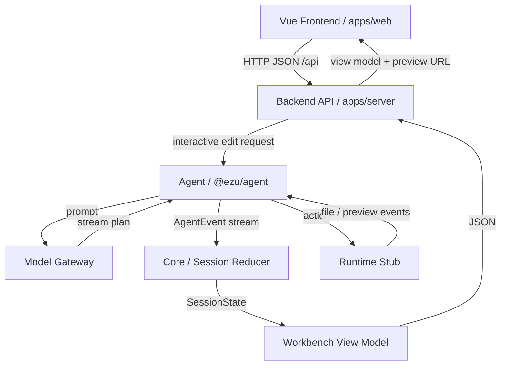

# ezuwebs.com

`ezuwebs.com` is a TypeScript monorepo for an AI-assisted web building workspace demo.

The current codebase is not a full production product yet. What exists today is a working repository skeleton that demonstrates:

- a shared event protocol for agent-driven actions
- session state reduction and action timelines
- a demo agent flow that generates block-scoped patch actions
- a browser-based runtime stub that can replay file and preview events
- a Vite web app that renders the workspace as an IDE-like session UI

## What It Does Now

The repository currently models this loop:

`user intent -> agent events -> session state -> workbench UI -> preview replay`

In practice, the demo focuses on an interactive webpage editing workflow:

- the web app loads demo sessions
- the agent app emits plan, message, action, interaction, file, and preview events
- the core package reduces those events into session state
- the UI package defines the workbench panel structure
- the browser runtime stub simulates file updates and preview opening

This makes the repo useful as a foundation for experimenting with AI workspace architecture before adding a real backend, real model calls, or a real remote runtime.

## Monorepo Layout

### Apps

The project uses a **decoupled frontend/backend architecture**: a Vue single-page app talks to a standalone HTTP API over JSON; the API owns the agent, session reduction, and runtime.

- `apps/web`
  Vue 3 + Vite single-page frontend. It renders the session launcher and the workbench (conversation, plan, approvals, action timeline, file tree, block editor, preview, terminal). It holds no agent logic and reaches the backend through `/api`.

- `apps/server`
  Node HTTP backend (`@ezu/server`). It reuses `@ezu/agent`, `@ezu/core`, and `@ezu/protocol` to bootstrap sessions, run block-edit flows, reduce agent events into a workbench view model, and serve the JSON API consumed by the frontend.

- `apps/agent`
  Demo agent flow that bootstraps block-edit sessions, generates file patch actions, requests approval, and replays preview events.

### Packages

- `packages/protocol`
  Shared Zod schemas and TypeScript types for plans, actions, runtime state, interactions, sessions, and agent events.

- `packages/core`
  Session store, event reduction, executor plumbing, and runtime adapter interfaces.

- `packages/model-gateway`
  Model routing/profile layer used by the demo. The current implementation is a stubbed gateway with separate planning, coding, review, summary, and title profiles.

- `packages/runtime-browser`
  In-browser runtime stub that can write files, patch files, emit file-watch events, and open a generated preview document.

- `packages/runtime-remote`
  Placeholder remote runtime adapter. It exists structurally, but is not implemented yet.

- `packages/ui`
  Shared workbench panel definitions and labels.

## Getting Started

### Requirements

- Node.js 20+
- `pnpm` 10+

### Install

```bash
pnpm install
```

### Run the full stack (frontend + backend)

```bash
pnpm dev
```

This starts the `@ezu/server` API (port `4175`) and the `@ezu/web` Vue dev server (port `4174`) together. The Vite dev server proxies `/api` to the backend, so open `http://127.0.0.1:4174`.

Run them individually if needed:

```bash
pnpm dev:server   # @ezu/server API only
pnpm dev:web      # @ezu/web Vue frontend only
pnpm start        # run the backend API in production mode
```

### Run the agent package in watch mode

```bash
pnpm dev:agent
```

### Build everything

```bash
pnpm build
```

### Typecheck

```bash
pnpm typecheck
```

### Test

```bash
pnpm test
```

Current tests cover the replacement-prompt and replacement-structure helpers used by the block-edit demo flows.

## HTTP API

The backend exposes a small JSON API under `/api` (default `http://127.0.0.1:4175`):

- `GET /api/sessions` — list demo session definitions.
- `POST /api/sessions` — create a session instance from `{ "definitionId" }` and return its workbench view model.
- `GET /api/sessions/:id` — fetch the current session view model.
- `GET /api/sessions/:id/files` — fetch the workspace file snapshot.
- `POST /api/sessions/:id/select-block` — select an editor block (`{ "blockId" }`).
- `POST /api/sessions/:id/edit` — run a block edit (`{ "intent", "patchStrategy", "properties" }`); the agent produces a fresh patch and approval request.
- `POST /api/sessions/:id/prompt` — queue a free-form prompt (`{ "text" }`).
- `POST /api/sessions/:id/approval` — resolve the pending approval (`{ "decision", "reason" }`).

## Current Architecture

### Data Flow



### Event protocol

`@ezu/protocol` defines the shared language between the agent, runtime, and UI:

- conversation messages
- plan updates
- action lifecycle events
- interaction requests and resolutions
- file change events
- preview readiness events

### Session reduction

`@ezu/core` turns event streams into session state. That state is then used by the web app to render:

- chat history
- plan status
- pending approvals
- action timeline
- changed files
- preview endpoints

### Demo editing flow

The current demo is centered on block-level webpage edits:

1. the web app creates an edit request for a selected block
2. the agent app turns that request into a suggested prompt
3. the model gateway streams demo coding output
4. the agent creates a `file.patch` action
5. the runtime stub replays the result and exposes a preview

## Demo Notes

- The web app includes predefined demo sessions such as `club-promo` and `agency-redesign`.
- The workspace file tree shown in the demo is loaded from the repository through `import.meta.glob`.
- The browser runtime preview can render HTML directly or show a structured fallback summary for non-HTML files.

## Project Status

This repository is still a prototype / architecture demo.

Notable limitations in the current code:

- no real backend or persistence layer
- no real LLM integration yet
- no implemented remote runtime
- no real filesystem execution sandbox
- demo sessions are seeded in code

## Reference Notes

Design and architecture notes are kept under `docs/design/`. They are useful for understanding the longer-term direction, but the source code in `apps/` and `packages/` is the best description of the current implementation.

---

## 中文摘要

`ezuwebs.com` 是一个 AI 辅助网页编辑工作台的 TypeScript monorepo 原型。目前处于架构验证阶段：已跑通 agent 事件生成 → 状态归并 → IDE 风格工作台渲染的闭环，但尚未接入真实 LLM、远程运行时或持久化层。

详细架构说明见 `docs/design/architecture-zh.md`；以 `future-` 开头的设计文档为下一阶段的规划参考。
