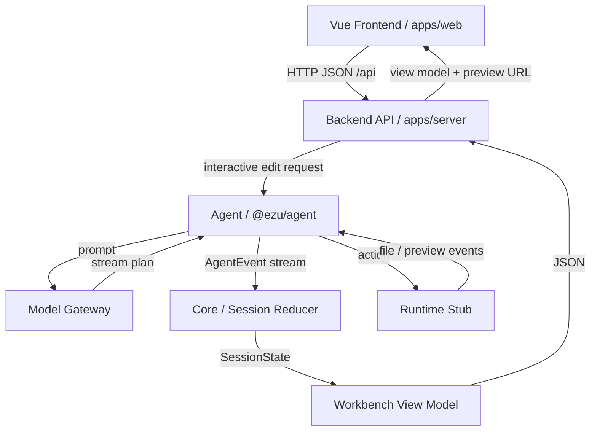
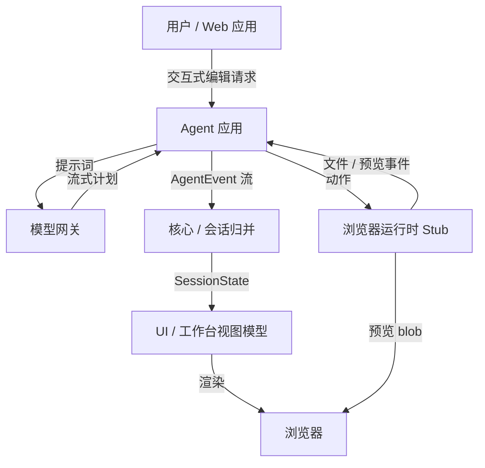

# ezuwebs.com

`ezuwebs.com` is a TypeScript monorepo for an AI-assisted web building workspace demo.

The current codebase is not a full production product yet. What exists today is a working repository skeleton that demonstrates:

- a shared event protocol for agent-driven actions
- session state reduction and action timelines
- a demo agent flow that generates block-scoped patch actions
- a browser-based runtime stub that can replay file and preview events
- a Vite web app that renders the workspace as an IDE-like session UI

## What It Does Now

The repository currently models this loop:

`user intent -> agent events -> session state -> workbench UI -> preview replay`

In practice, the demo focuses on an interactive webpage editing workflow:

- the web app loads demo sessions
- the agent app emits plan, message, action, interaction, file, and preview events
- the core package reduces those events into session state
- the UI package defines the workbench panel structure
- the browser runtime stub simulates file updates and preview opening

This makes the repo useful as a foundation for experimenting with AI workspace architecture before adding a real backend, real model calls, or a real remote runtime.

## Monorepo Layout

### Apps

The project uses a **decoupled frontend/backend architecture**: a Vue single-page app talks to a standalone HTTP API over JSON; the API owns the agent, session reduction, and runtime.

- `apps/web`
  Vue 3 + Vite single-page frontend. It renders the session launcher and the workbench (conversation, plan, approvals, action timeline, file tree, block editor, preview, terminal). It holds no agent logic and reaches the backend through `/api`.

- `apps/server`
  Node HTTP backend (`@ezu/server`). It reuses `@ezu/agent`, `@ezu/core`, and `@ezu/protocol` to bootstrap sessions, run block-edit flows, reduce agent events into a workbench view model, and serve the JSON API consumed by the frontend.

- `apps/agent`
  Demo agent flow that bootstraps block-edit sessions, generates file patch actions, requests approval, and replays preview events.

### Packages

- `packages/protocol`
  Shared Zod schemas and TypeScript types for plans, actions, runtime state, interactions, sessions, and agent events.

- `packages/core`
  Session store, event reduction, executor plumbing, and runtime adapter interfaces.

- `packages/model-gateway`
  Model routing/profile layer used by the demo. The current implementation is a stubbed gateway with separate planning, coding, review, summary, and title profiles.

- `packages/runtime-browser`
  In-browser runtime stub that can write files, patch files, emit file-watch events, and open a generated preview document.

- `packages/runtime-remote`
  Placeholder remote runtime adapter. It exists structurally, but is not implemented yet.

- `packages/ui`
  Shared workbench panel definitions and labels.

## Getting Started

### Requirements

- Node.js 20+
- `pnpm` 10+

### Install

```bash
pnpm install
```

### Run the full stack (frontend + backend)

```bash
pnpm dev
```

This starts the `@ezu/server` API (port `4175`) and the `@ezu/web` Vue dev server (port `4174`) together. The Vite dev server proxies `/api` to the backend, so open `http://127.0.0.1:4174`.

Run them individually if needed:

```bash
pnpm dev:server   # @ezu/server API only
pnpm dev:web      # @ezu/web Vue frontend only
pnpm start        # run the backend API in production mode
```

### Run the agent package in watch mode

```bash
pnpm dev:agent
```

### Build everything

```bash
pnpm build
```

### Typecheck

```bash
pnpm typecheck
```

### Test

```bash
pnpm test
```

Current tests cover the replacement-prompt and replacement-structure helpers used by the block-edit demo flows.

## HTTP API

The backend exposes a small JSON API under `/api` (default `http://127.0.0.1:4175`):

- `GET /api/sessions` — list demo session definitions.
- `POST /api/sessions` — create a session instance from `{ "definitionId" }` and return its workbench view model.
- `GET /api/sessions/:id` — fetch the current session view model.
- `GET /api/sessions/:id/files` — fetch the workspace file snapshot.
- `POST /api/sessions/:id/select-block` — select an editor block (`{ "blockId" }`).
- `POST /api/sessions/:id/edit` — run a block edit (`{ "intent", "patchStrategy", "properties" }`); the agent produces a fresh patch and approval request.
- `POST /api/sessions/:id/prompt` — queue a free-form prompt (`{ "text" }`).
- `POST /api/sessions/:id/approval` — resolve the pending approval (`{ "decision", "reason" }`).

## Current Architecture

### Data Flow



### Event protocol

`@ezu/protocol` defines the shared language between the agent, runtime, and UI:

- conversation messages
- plan updates
- action lifecycle events
- interaction requests and resolutions
- file change events
- preview readiness events

### Session reduction

`@ezu/core` turns event streams into session state. That state is then used by the web app to render:

- chat history
- plan status
- pending approvals
- action timeline
- changed files
- preview endpoints

### Demo editing flow

The current demo is centered on block-level webpage edits:

1. the web app creates an edit request for a selected block
2. the agent app turns that request into a suggested prompt
3. the model gateway streams demo coding output
4. the agent creates a `file.patch` action
5. the runtime stub replays the result and exposes a preview

## Demo Notes

- The web app includes predefined demo sessions such as `club-promo` and `agency-redesign`.
- The workspace file tree shown in the demo is loaded from the repository through `import.meta.glob`.
- The browser runtime preview can render HTML directly or show a structured fallback summary for non-HTML files.

## Project Status

This repository is still a prototype / architecture demo.

Notable limitations in the current code:

- no real backend or persistence layer
- no real LLM integration yet
- no implemented remote runtime
- no real filesystem execution sandbox
- demo sessions are seeded in code

## Reference Notes

Design and architecture notes are kept under `docs/txt/`. They are useful for understanding the longer-term direction, but the source code in `apps/` and `packages/` is the best description of the current implementation.

## 中文说明

`ezuwebs.com` 是一个 TypeScript monorepo，用来承载一个 AI 辅助网页构建工作台的演示原型。

当前仓库还不是完整的生产级产品。现在已经落地的部分，主要是一个可以运行的基础骨架，覆盖了这些能力：

- 面向 agent 动作的共享事件协议
- 会话状态归并与动作时间线
- 生成 block 级 patch 动作的 demo agent 流程
- 可回放文件事件和预览事件的浏览器运行时 stub
- 以 IDE 风格展示工作台会话的 Vite Web 应用

## 当前实现了什么

这个仓库当前描述的是这样一条流程：

`用户意图 -> agent 事件 -> 会话状态 -> 工作台 UI -> 预览回放`

在实际代码里，demo 主要聚焦在交互式网页编辑流程上：

- Web 应用加载预设 demo 会话
- Agent 应用发出 plan、message、action、interaction、file 和 preview 事件
- Core 包把这些事件归并成统一的 session state
- UI 包定义工作台面板结构
- 浏览器运行时 stub 模拟文件更新和预览打开

因此，这个仓库目前更适合作为 AI 工作台架构实验的基础，而不是一个已经接通真实后端、真实模型调用或真实远程运行时的完整产品。

## Monorepo 结构

### Apps

项目采用**前后端分离架构**：Vue 单页应用通过 JSON 与独立的 HTTP API 通信，后端负责 agent、会话归并与运行时。

- `apps/web`
  Vue 3 + Vite 单页前端。负责渲染会话启动页和工作台（对话、计划、审批、动作时间线、文件树、block 编辑器、预览、终端）。前端不包含 agent 逻辑，全部通过 `/api` 调用后端。

- `apps/server`
  Node HTTP 后端（`@ezu/server`）。复用 `@ezu/agent`、`@ezu/core`、`@ezu/protocol` 来初始化会话、运行 block 编辑流程、把 agent 事件归并成工作台视图模型，并对外提供前端消费的 JSON API。

- `apps/agent`
  Demo agent 流程。负责初始化 block 编辑会话、生成文件 patch 动作、请求审批，并回放预览事件。

### Packages

- `packages/protocol`
  共享的 Zod schema 和 TypeScript 类型定义，覆盖 plan、action、runtime state、interaction、session 和 agent event。

- `packages/core`
  提供 session store、事件归并、执行器基础逻辑以及 runtime adapter 接口。

- `packages/model-gateway`
  Demo 使用的模型路由 / profile 层。当前实现仍然是 stub，但已经区分了 planning、coding、review、summary 和 title 等角色。

- `packages/runtime-browser`
  浏览器内运行时 stub，可以写文件、patch 文件、发出文件监听事件，并打开生成的预览文档。

- `packages/runtime-remote`
  远程运行时适配层的占位实现。目前只有结构，还没有真正完成。

- `packages/ui`
  共享的工作台面板定义和标签。

## 快速开始

### 环境要求

- Node.js 20+
- `pnpm` 10+

### 安装依赖

```bash
pnpm install
```

### 启动前后端

```bash
pnpm dev
```

这个命令会同时启动 `@ezu/server` API（端口 `4175`）和 `@ezu/web` Vue 开发服务器（端口 `4174`）。Vite 会把 `/api` 代理到后端，打开 `http://127.0.0.1:4174` 即可。

如需分别启动：

```bash
pnpm dev:server   # 仅后端 API
pnpm dev:web      # 仅 Vue 前端
pnpm start        # 以生产模式运行后端 API
```

### 以 watch 模式启动 agent 包

```bash
pnpm dev:agent
```

### 构建全部包

```bash
pnpm build
```

### 类型检查

```bash
pnpm typecheck
```

### 运行测试

```bash
pnpm test
```

当前测试主要覆盖 block-edit demo 相关的 replacement prompt 和 replacement structure 辅助逻辑。

## 当前架构

### 数据流



### 事件协议

`@ezu/protocol` 定义了 agent、runtime 和 UI 之间共享的事件语言，包括：

- 会话消息
- 计划更新
- 动作生命周期事件
- 交互请求与交互结果
- 文件变更事件
- 预览就绪事件

### 会话状态归并

`@ezu/core` 负责把事件流归并成 session state，随后由 Web 应用渲染出：

- 聊天记录
- 计划状态
- 待审批项
- 动作时间线
- 已变更文件
- 预览地址

### Demo 编辑流程

当前 demo 的核心是 block 级网页编辑：

1. Web 应用为选中的 block 创建编辑请求
2. Agent 应用把这个请求转换成建议 prompt
3. Model gateway 流式输出 demo coding 结果
4. Agent 创建一个 `file.patch` 动作
5. Runtime stub 回放结果并暴露预览

## Demo 说明

- Web 应用内置了 `club-promo`、`agency-redesign` 等预设 demo 会话。
- Demo 中展示的 workspace 文件树通过 `import.meta.glob` 从当前仓库加载。
- 浏览器运行时预览可以直接渲染 HTML，也可以在输入不是 HTML 时显示结构化摘要视图。

## 项目状态

这个仓库目前仍然是一个原型 / 架构演示项目。

当前代码里的主要限制包括：

- 还没有真实后端或持久化层
- 还没有真正接入 LLM
- 远程运行时还未实现
- 还没有真实文件系统执行沙箱
- demo 会话内容是直接写在代码里的

## 参考文档

设计和架构说明保存在 `docs/txt/` 目录下。它们适合用来了解项目的长期方向，但如果要理解当前已经实现的内容，还是以 `apps/` 和 `packages/` 下的源码为准。
